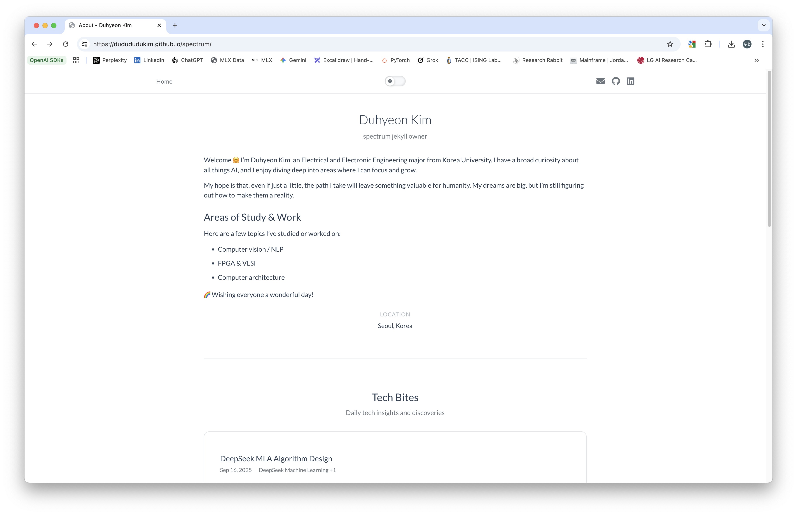
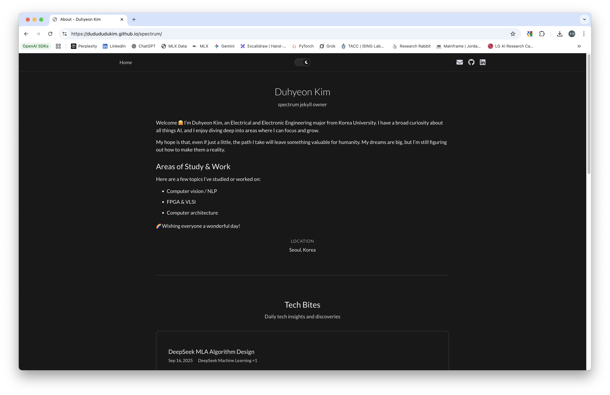
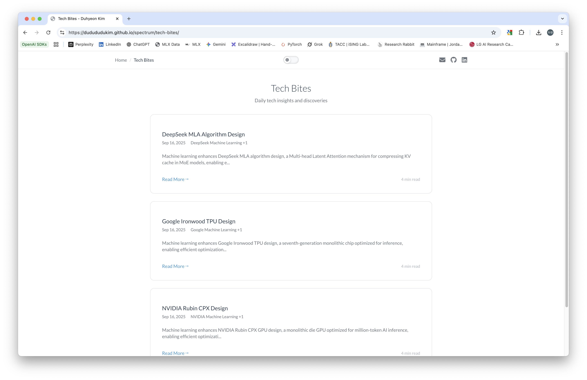
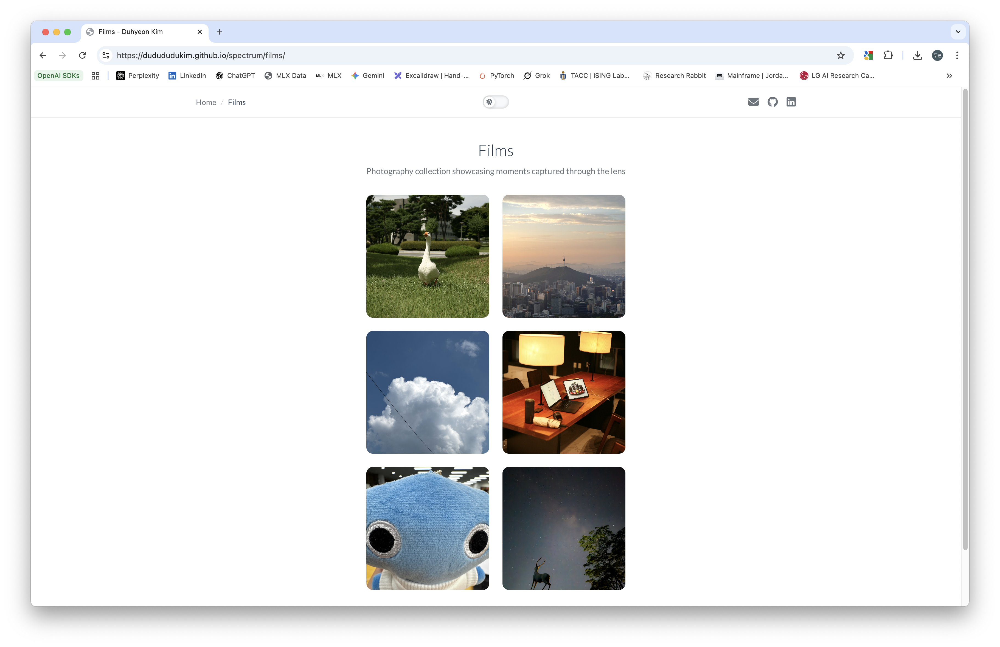
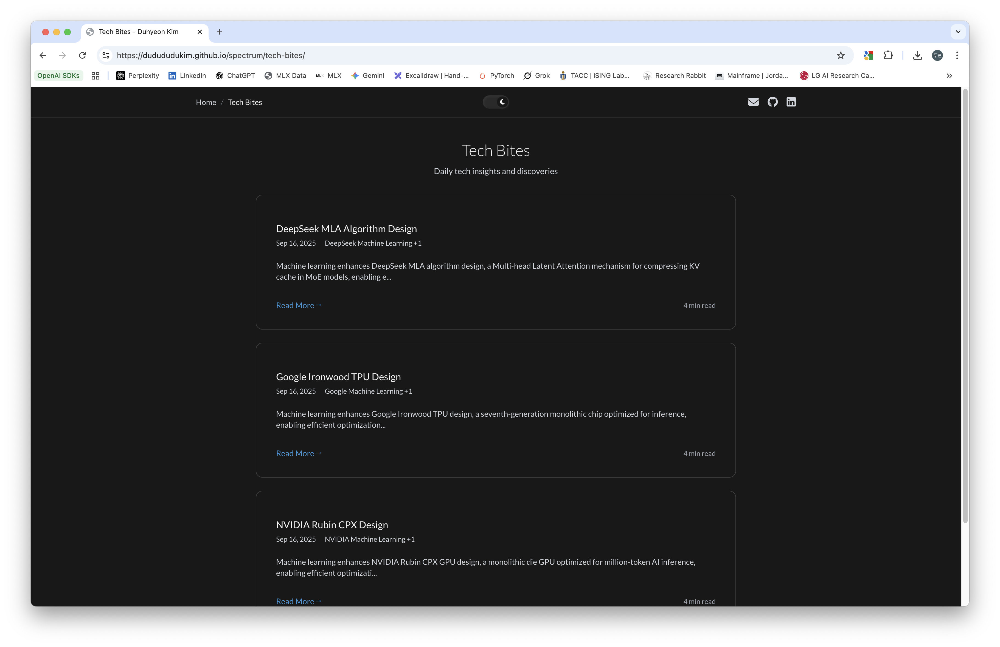
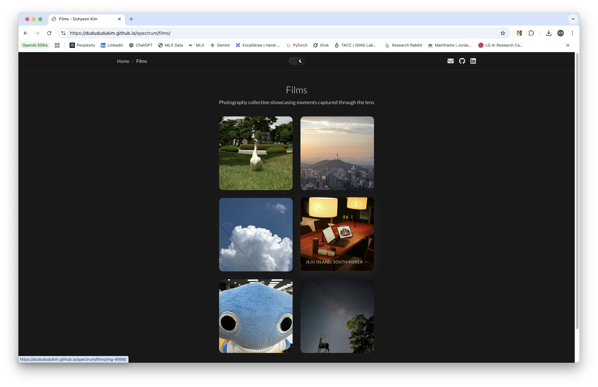
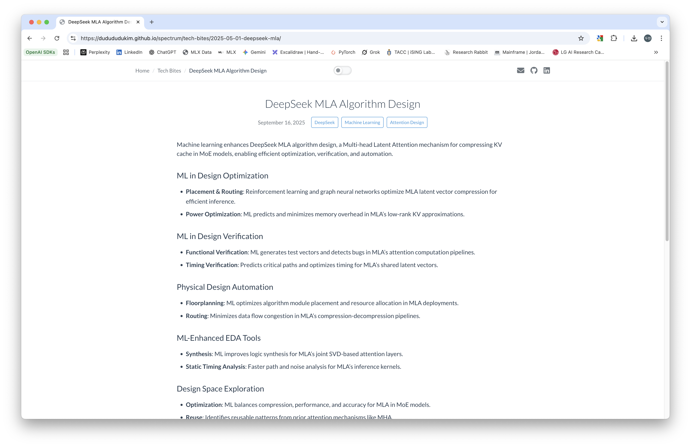
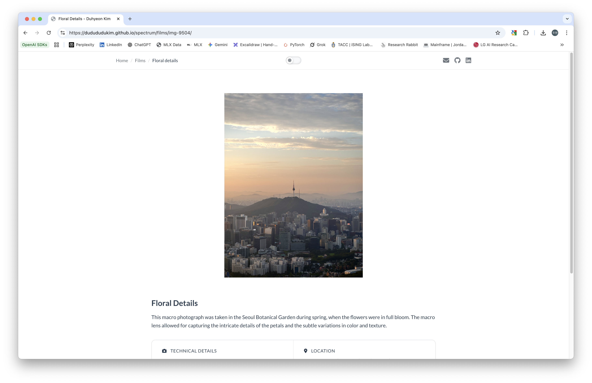
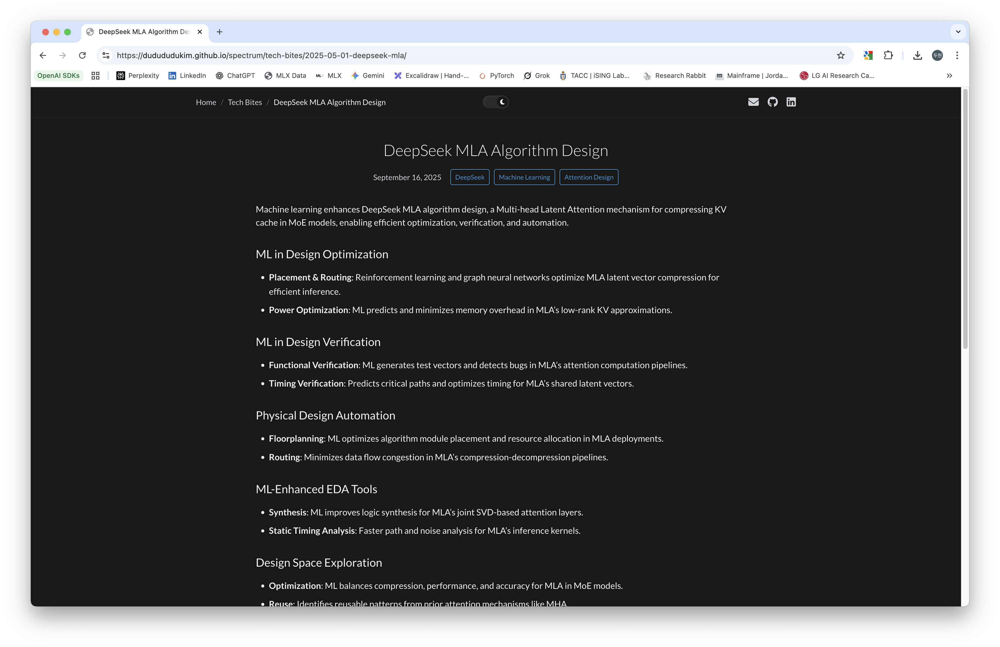
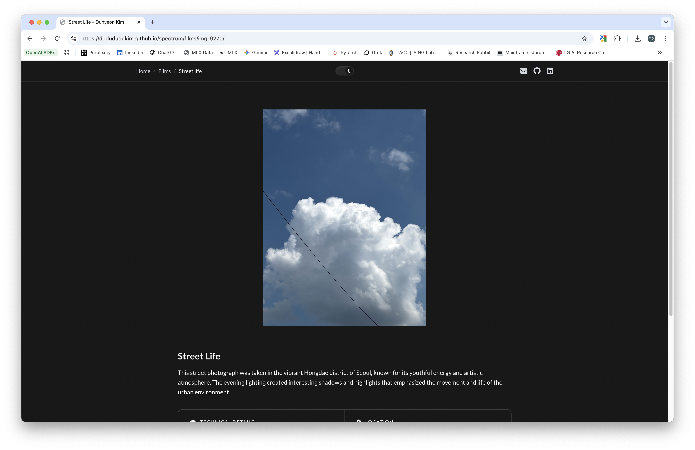

# Spectrum - Minimal Jekyll Theme


[](https://jekyllrb.com/)
[](https://www.ruby-lang.org/)
[](https://opensource.org/licenses/MIT)
[](https://github.com/dudududukim/spectrum)
[](https://jekyll-themes.com/dudududukim/spectrum)


<div align="center">

### 🚀 **LIVE DEMO**
**[dudududukim.github.io/spectrum-eager/](https://dudududukim.github.io/spectrum-eager/)**

_👆 Click here to see the live demo!_

</div>



A clean and minimal **Jekyll theme** designed for personal websites and blogs with a focus on simplicity and customizability. Perfect for professional researchers, undergraduates, and creators from diverse backgrounds who want an easy-to-use yet flexible platform.

# Spectrum Jekyll Theme

A minimal, responsive Jekyll theme with excellent typography and dynamic color theming. Perfect for developers, researchers, and creatives who want a clean, professional website.

## ✨ Key Features

- **Dynamic Primary Color System** - Change one color in `_config.yml` to instantly personalize your entire site
- **Dual Content Types**: 
  - **Tech Bites**: Blog posts, paper summaries, or journal entries
  - **Films**: Photography gallery with markdown descriptions and metadata
- **Responsive Design** with mobile-first approach
- **Light & Dark Theme** support with automatic switching
- **Minimal & Clean** design focused on readability
- **GitHub Actions** deployment ready


## Quick Start

### Prerequisites
- Ruby 3.2+ and Bundler
- Git

### Installation
1. Clone the repo
```
git clone git@github.com:dudududukim/spectrum-eager.git
cd spectrum-eager
```
2. Install dependencies
```
bundle install
```
3. Configure your site
   - Edit `_config.yml` to update site details, personal bio, and colors

4. **Enable GitHub Pages deployment**
   - Go to **Settings > Pages** in your GitHub repository
   - Set **Source** to "**GitHub Actions**"

5. Run locally
```
bundle exec jekyll serve
```
6. Visit `http://localhost:4000` in your browser

## Usage & Customization

### Tech Bites Section
- **Versatile content space**: Use for blog posts, paper summaries, research notes, or general articles
- Create Markdown files in `_posts/` and set `section: "tech-bites"` in the front matter
- Perfect for sharing insights, tutorials, or academic work

### Films Section
- **Photography showcase**: Upload your own photos or hobby images
- **Rich descriptions**: Add Markdown files to provide context, stories, or technical details about your photos
- Great for visual portfolios or travel documentation

### Dynamic Theming
- **One-click personalization**: Change the `primary` color in `_config.yml` to instantly transform your site's appearance
- All UI elements automatically adapt to your chosen color scheme

## Deployment

### GitHub Pages
This **Jekyll theme** is ready for immediate deployment with GitHub Actions.
- Workflow file `.github/workflows/jekyll.yml` is included and ready to use
- Simply enable GitHub Actions as the source in **Settings > Pages**
- Push your changes and watch your site deploy automatically!

### Other Platforms
- **Netlify**: Auto-detects Jekyll and builds automatically
- **Vercel**: Compatible with standard Jekyll builds
- **Self-hosted**: Use `bundle exec jekyll build` for static files

## 🎨 Live Preview

### Homepage Overview
| Light Theme | Dark Theme |
|-------------|------------|
|  |  |

### Content Sections
| Tech Bites | Films Gallery |
|------------|---------------|
|  |  |
|  |  |

### Individual Content Pages
| Markdown Content | Photo detail page |
|------------------|-------------------|
|  |  |
|  |  |


## Project Structure

```
<repo-root>/
├── .github/
│   ├── workflows/
│   │   └── jekyll.yml         # GitHub Actions workflow for auto-deployment
│   └── FUNDING.yml            # GitHub Sponsors funding configuration
├── _data/
│   ├── navigation.yml         # Site navigation menu configuration
│   └── sections.yml           # Section definitions (mirrors _sections/*/config.yml)
├── _includes/                 # Reusable Liquid components
│   ├── get-section-config.html
│   ├── section-tech-bites-preview.html
│   ├── tech-bite-card.html
│   ├── content-card.html
│   ├── photo-card.html
│   └── ...                    # Other includes
├── _layouts/                  # Page templates
│   ├── default.html           # Base layout
│   ├── about.html             # Homepage layout
│   ├── post.html              # Blog post layout
│   ├── post-list.html         # Blog listing layout
│   ├── tech-bite.html         # Tech bite detail layout
│   ├── tech-bite-list.html    # Tech bite listing layout
│   ├── films-list.html        # Films gallery layout
│   └── film-detail.html       # Film detail layout
├── _sass/                     # SCSS stylesheets
│   ├── _base.scss             # Base styles
│   ├── _color-variables.scss  # Color system
│   ├── _components.scss       # Component styles
│   ├── _layouts.scss          # Layout styles
│   ├── _sections.scss         # Section-specific styles
│   └── _utilities.scss        # Utility classes
├── _sections/                 # Section configurations (YAML-first architecture)
│   ├── tech-bites/
│   │   └── config.yml         # Tech Bites section config (title, pagination, etc.)
│   ├── 3d-printing/
│   │   └── config.yml         # 3D Printing section config
│   └── research-hw/
│       └── config.yml         # Research (HW) section config
├── _posts/                    # All blog posts (filtered by `section` front matter)
│   └── YYYY-MM-DD-title.md    # Posts with section: "tech-bites" | "3d-printing" | etc.
├── _films/                    # Photography markdown files
│   └── IMG_*.md               # Film entries with photo metadata
├── assets/
│   ├── css/
│   │   └── main.scss          # Main stylesheet entry point
│   ├── images/                # Site images
│   │   ├── films/             # Film photos
│   │   └── me/                # Profile images
│   └── js/                    # JavaScript files
│       ├── theme-toggle.js
│       └── reading-progress.js
├── images/                    # Static images (screenshots, etc.)
├── _config.yml                # Main site configuration
│   ├── Site settings (url, title, description)
│   ├── Theme colors (primary color system)
│   ├── Collections (posts, films, sections)
│   ├── Plugins (jekyll-sitemap, jekyll-seo-tag)
│   └── Homepage sections configuration
├── 404.html                   # Custom 404 error page
├── index.md                   # Homepage content
├── tech-bites.md              # Tech Bites listing page
├── 3d-printing.md             # 3D Printing listing (posts with section: "3d-printing")
├── research-hw.md             # Research (HW) listing (posts with section: "research-hw")
├── films.md                   # Photography gallery page
├── Gemfile                    # Ruby dependencies
├── Gemfile.lock               # Locked dependency versions
├── LINCESE.txt                # MIT License
└── README.md                  # This file
```

### Key YAML Configuration Files

- **`_config.yml`**: Main site configuration
  - Site identity (title, description, author)
  - Theme colors (primary color system)
  - Collections definition (posts, films, sections)
  - Jekyll plugins configuration
  - Homepage sections settings

- **`_data/navigation.yml`**: Navigation menu structure
  - Menu items and links
  - Navigation order

- **`_data/sections.yml`**: Section definitions mirror
  - Mirrors `_sections/*/config.yml` files
  - Used by Liquid templates to access section configs
  - Contains: title, description, button_text, pagination, etc.

- **`_sections/*/config.yml`**: Section-specific configurations
  - **`tech-bites/config.yml`**: Tech Bites section settings
  - **`3d-printing/config.yml`**: 3D Printing section settings
  - **`research-hw/config.yml`**: Research (HW) section settings
  - Each contains: `title`, `key`, `description`, `button_text`, `button_url`, `order`, `type`, `enabled`, `main_page_count`, `pagination`, `show_dates`, `show_categories`

## Development

Use `bundle exec jekyll serve` for local development with live reload.

## Contributing

Fork the repository, create a feature branch, commit your changes, and open a pull request.

## Author

**Duhyeon Kim**
- GitHub: [@dudududukim](https://github.com/dudududukim)
- LinkedIn: [Duhyeon Kim](https://www.linkedin.com/in/duhyeon-kim-6623082b1/)

## License

MIT License. See LINCESE.txt file for details.

## Support

Submit issues via GitHub Issues or check inline documentation in code files.

---

## Show Your Support

**⭐ If you find this Jekyll theme helpful, please give it a star on GitHub!** Your support helps maintain and improve this project for everyone.

**⭐ Star this repository** to show your appreciation and help others discover this theme!

---

**Built with Jekyll**
